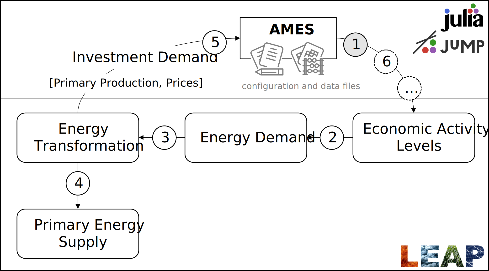

```@meta
CurrentModule = AMES
```

# [LEAP-AMES link](@id leap-ames-link)
The link between the LEAP energy model and the AMES economic model is shown in the diagram below. For each of the sub-models -- LEAP and AMES -- most of the model development can be done independently. That allows energy experts to work on LEAP and economists to work on AMES, collaborating only where the models interact.

The combined model is solved iteratively. The AMES model runs first, generating economic activity levels as inputs to LEAP. Then, LEAP runs, simulating the energy system. Among other results, LEAP may report energy sector investment, the supply of primary energy sources, and prices. These outputs can become inputs to the AMES model. If investment is calculated anywhere in LEAP, then it is collected and fed as an input to AMES. Primary energy production and prices are transferred if the correspondence between LEAP and AMES is specified in the [configuration file](@ref config-link-LEAP).

After LEAP runs, the AMES model runs again, and the iteration proceeds until the maximum percent difference in economic activity levels in subsequent runs falls below a user-specified tolerance. In practice, only a few iterations (2 to 3) should be sufficient.



The AMES model requires a [supply-use table](@ref sut) and some [parameter files](@ref params) as inputs, as well as a [configuration file](@ref config). The [mapping between AMES and LEAP](@ref config-link-LEAP) is managed through the configuration file.
