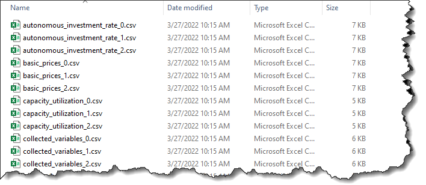

```@meta
CurrentModule = LEAPMacro
```

# [Output files](@id model-outputs)
When Macro is run, it generates several output files in the following folders:
```
otuputs 
└───NAME
    └───calibration
    └───[diagnostics]
    └───results
```
The `NAME` of the folder under `outputs` is specified by the `output_folder` parameter in the [configuration file](@ref config). The `diagnostics` folder is only present if the `report-diagnostics` parameter is set to `true` in the [configuration file](@ref config).

Different scenarios can be specified by different configuration files, with different `output_folder` parameters set. In that case, there will be several folders:
```
otuputs 
└───NAME 1
    └───calibration
    └───[diagnostics]
    └───results
└───NAME 2
    └───calibration
    └───[diagnostics]
    └───results
...
```

In addition, Macro writes a log file to the main folder. It is overwritten each time Macro is run, so to save a log file, it should be renamed. However, normally it is not needed to save log files, because they are most useful when developing and debugging a model. If the model fails, then the error message will be written to the log file.

## The `diagnostics` folder
When the `report-diagnostics` parameter is set to `true`, a variety of diagnostic outputs are reported.

One crucial diagnostic indicator is given in the file `nonenergy_energy_link_measure.txt`. It contains a message like the following:
```
Measure of the significance to the economy of the supply of non-energy goods and services to the energy sector:
This value should be small: 3.55%.
```
Whether the estimated parameter is sufficiently small or not depends on the purposes of the analysis. For the Freedonia sample model, it suggests that excluding the demand by the energy sector of non-energy goods and services could lead to a roughly 4% discrepancy.

An additional set of files with names such as `model_0_2010.txt` provide an export of the [linear goal program](@ref lgp) prepared by the Macro model. Examining these files can sometimes be helpful when the log file indicates an error in JuMP (the Julia mathematical programming library). The file offers an explicit formulation of the model, with the estimated parameters:
```
Min 1.7333333333333334 ugap[1] + 0.5333333333333333 ugap[2] + 0.6000000000000001 ugap[3] + ...
Subject to
 eq_util[1] : ugap[1] + u[1] == 1.0
 eq_util[2] : ugap[2] + u[2] == 1.0
 eq_util[3] : ugap[3] + u[3] == 1.0
 eq_util[4] : ugap[4] + u[4] == 1.0
...
```

Some of the files provide "sanity checks" on the input data. 
  * `demand_coefficients.csv`: These should sum to a total less than one down the columns
  * `imported_fraction.csv`: These should be less than one
  * `profit_margins.csv`: These should be greater than 1 but (usually) less than 2
  * `supply_fractions.csv`: These should sum to one along rows (unless the product is not produced domestically, in which case the sum will be zero)

Other files report figures that should be close to, although not necessarily identical to, the corresponding values in the supply-use table. The differences should be explained by Macro compensating for territorial adjustments or stock changes:
  * `domestic_production.csv`
  * `exports.csv`
  * `final_demand.csv`
  * `imports.csv`
  * `investment.csv`
  * `margins.csv`
  * `sector_output.csv`
  * `tax_rate.csv`
  * `tot_intermediate_demand_all_products.csv`
  * `tot_intermediate_supply_all_sectors.csv`
  * `tot_intermediate_supply_non-energy_sectors.csv`: Note that these values will be lower than in the supply-use table due to the excluded energy sectors
  * `wages.csv`

## The `calibration` folder
The files in this folder are generated after further adjustments and a calibration run of the [linear goal program](@ref lgp). Some of these files can also be used as a "sanity check", including:
  * `basic_prices_0.csv`: These should be close to 1
  * `capacity_utilization_0.csv`: These should be less than or equal to 1, and most should be close to 1
  * `capital_output_ratio_0.csv`: These should normally lie between 1 and 4, but may be outside that range
  * `margins_neg_0.csv` and `margins_pos_0.csv`: These should sum to the same total
  * `wage_share_0.csv`: These should be less than 1

Others of the files in the `calibration` folder have names similar to the `diagnostics` folder. The values may be noticeably different due to the adjustments carried out by the Macro model:
  * `domestic_production_0.csv`
  * `exports_0.csv`
  * `final_demand_0.csv`
  * `imports_0.csv`
  * `sector_output_0.csv`
  * `tot_intermediate_supply_non-energy_sectors_0.csv`

## The `results` folder
The `results` folder contains the simulation results from the model. Once the model is fully developed, calibrated, and running in practice, this is the most interesting folder to look at.

When running with LEAP, the Macro model may be run several times to converge on a consistent set of results. The results folder contains outputs from each of the runs:


