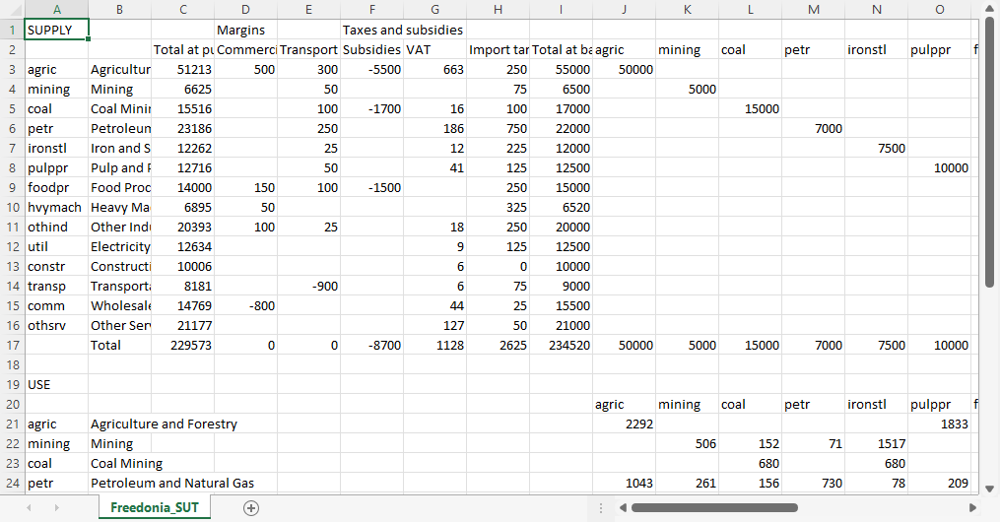

```@meta
CurrentModule = AMES
```

# [Supply-use and input-output tables](@id sut)
Supply and use tables (or "supply-use tables" for short) and input-output tables are part of national economic accounts.

The **supply table** records the total value of payments for goods and services sold by businesses within the country, together with imports. To those "basic" values are added taxes net of subsidies, as well as an adjustment for trade and transport margins.

The margins correct for goods, such as agricultural produce, whose sales are recorded in, say, wholesale trade or commercial transport. Entries in the margins columns of the supply table subtract the value of payments from wholesale and commercial transport and add the value to the corresponding product -- in this example, agricultural produce.

The **use table** records sales of goods and services to businesses -- termed intermediate use -- as well as sales to households and the government -- final domestic use -- and to export markets. Sales are also recorded for investment goods, such as buildings and machinery, including the cost of construction and installation. Sometimes investment is reported separately for business, households, and the government.

Total sales by businesses, net of intermediate payments, is "value added". In the use table, value added is allocated to payments to so-called "factors of production", in particular the wages and salaries of employees and the businesses' profit, together with associated taxes and social payments. The total of value added across all sectors is GDP.[^1]

An **input-output** table is simpler than a set of supply-use tables and contains less information. Input-output tables represent flows of payments between sectors (a sector × sector table) or for products (a product × product table). Otherwise, many of the columns and rows are similar. One difference is that input-output tables do not report margins and taxes on products.

[^1]: Specifically, it is GDP at market prices. Subtracting taxes on production activities and adding subsidies (so-called "indirect" taxes such as registration fees, rather than direct taxes and subsidies on products) gives GDP at factor cost.

!!! tip "Availability of supply-use tables"
    Unlike GDP, which is updated at least each year, and sometimes more frequently, in most countries supply-use tables (SUTs), input-output (IO) tables, or related products such as social accounting matrices (SAMs), are calculated infrequently. In some countries the national statistical office may not report SUTs, IO tables, or SAMs at all. If none is available, then the AMES model cannot be applied. However, by now a large number of countries do have at least one set of tables. One particularly good source is the International Food Policy Research Institute (IFPRI), which has been assisting countries with constructing SAMs. They make the datasets and documentation available on the [IFPRI Dataverse](https://dataverse.harvard.edu/dataverse/IFPRI?q=&fq2=seriesName_s%3A%22Social+Accounting+Matrix+%28SAM%29%22&fq0=subtreePaths%3A%22%2F99%22&fq1=dvObjectType%3A%28dataverses+OR+datasets%29&types=dataverses%3Adatasets&sort=dateSort&order=).

      * For more information on supply-use tables, see [_Handbook on Supply and Use Tables and Input-Output Tables with Extensions and Applications_](https://unstats.un.org/unsd/nationalaccount/docs/SUT_IOT_HB_Final_Cover.pdf) from UN Statistics
      * For more information on SAMs, see [_Social accounting matrices and multiplier analysis: An introduction with exercises_](https://www.ifpri.org/publication/social-accounting-matrices-and-multiplier-analysis) from the International Food Policy Research Institute.

## Format of a supply-use table
The supply-use table is the most flexible of the AMES model input files. That is because supply-use tables vary widely in their level of detail and layout. However, AMES does have some restrictions, so some processing is normally required:
  * All of the tables must be in a single comma-separated variable (CSV) file;
  * The tables and columns must be oriented in a specific direction, with products labeling rows and sectors labeling columns;
  * To be summed together, groups of columns or groups of rows must be next to each other.
An example model is provided with the Freedonia example, called `Freedonia_SUT.csv`. 

!!! info "Aggregate products that are close substitutes"
    Because of the AMES model logic, it is best if the table is not too disaggregated. Specifically, different products should not be close substitutes for one another. For example, if crops are represented, then "cereals" might be a useful category, but reporting different cereal grains as separate products -- such as rice, wheat, maize, and sorghum -- could be problematic if they are readily substituted in diets. If one of those grains were very unlikely to be substituted for the others, such as rice, then "rice" and "other cereals" could be a reasonable level of aggregation.

Many supply-use tables or social accounting matrices are provided as Excel files (or STATA, SPSS, or other format). What is more, sometimes the supply table will be on one worksheet tab and the use table on another, or even in separate files. For the AMES model to use them, they must be placed into a single CSV file.

!!! info "Comma-separated variable (CSV) files"
    CSV-formatted files are plain text files that can be viewed in a text editor. They can also be opened and modified in Excel, Google Sheets, or other spreadsheet program, which is a convenient way to edit them. Here is a portion of the supply-use table for the Freedonia example model, opened in Excel:

    

## Format of an input-output table
The input-output file format is similar to that of a supply-use table, but simpler. The same restrictions apply as for a supply-use table:
  * The table must be in a single comma-separated variable (CSV) file;
  * The rows and columns must be oriented in a specific direction;
  * To be summed together, groups of columns or groups of rows must be next to each other.

Please see the file `Freedonia_IO.csv` for an example.

## Linking the supply-use or input-output table to AMES
The link between the supply-use or input-output table file and the AMES model is specified in the [configuration file](@ref config-sut). For models based on a supply-use table, the relevant block in the configuration file specifies the range in the CSV file for two matrices -- the supply table and the use table -- with products labeling the rows and sectors labeling the columns. For models based on an input-output table, the relevant block specifies a range in the CSV file for a single matrix -- the IO table.

In addition to the matrices there are columns (with entries for each product) and rows (with entries for each sector). AMES does not require all of the columns and rows in the table to be identified -- it uses a subset of them. Furthermore, it will sum up adjacent columns and rows. For example, in AMES, "final demand" includes household and government expenditure. There may be many households listed, particularly in a social accounting matrix.

For more details, see the section on [linking to the supply-use table](@ref config-sut) in the documentation for the [configuration file](@ref config).

!!! info "Terminology for supply-use and input-output tables"
    There are standard short-hand terms used in economic modeling that are named more descriptively in most supply-use tables or social accounting matrices. For example, "investment" is usually reported as "gross fixed capital formation" (GFCF), to distinguish it from net fixed capital formation (net of depreciation) and additions to inventories. Here is a partial list:

    | Term in the AMES model | Other terms you might see                               |
    |:------------------------|:--------------------------------------------------------|
    | sectors                 | industries, activities                                  |
    | products                | commodities, goods and services                         |
    | wages                   | wages and other compensation, labor (as a factor)       |
    | profits                 | gross operating surplus, surplus, capital (as a factor) |
    | investment              | gross fixed capital formation, GFCF                     |
    | stock changes           | changes in inventories                                  |
